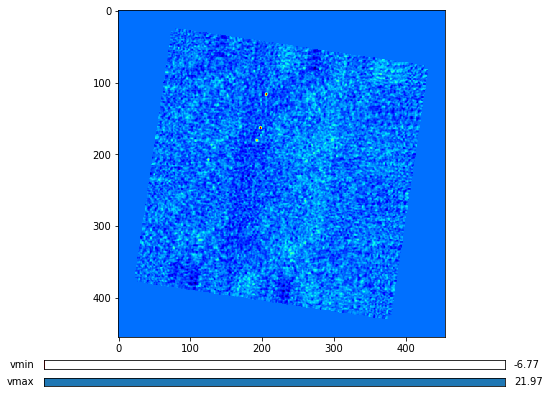
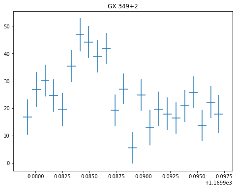
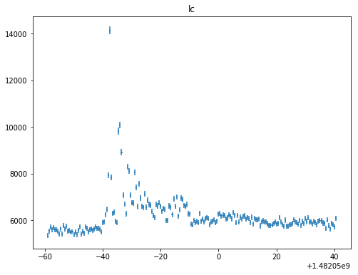
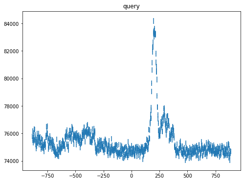
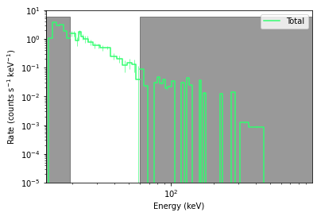
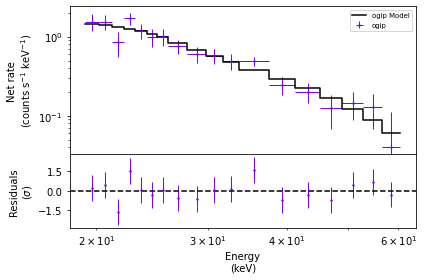
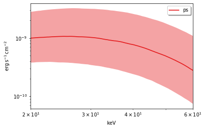
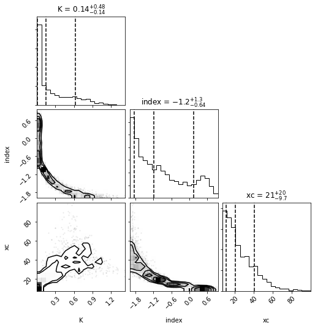
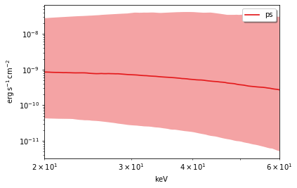

Quick Start (oda api v1.0.0)
============================

.. code:: ipython3

    from oda_api.api import DispatcherAPI
    from oda_api.plot_tools import OdaImage,OdaLightCurve
    from oda_api.data_products import BinaryData
    import os
    #%matplotlib notebook

Connection to the dispatcher
----------------------------

build the dispatcher object
~~~~~~~~~~~~~~~~~~~~~~~~~~~

.. code:: ipython3

    disp=DispatcherAPI(host='www.astro.unige.ch/cdci/astrooda/dispatch-data',instrument='mock',protocol='https')

.. code:: ipython3

    instr_list=disp.get_instruments_list()
    for i in instr_list:
        print (i)

.. parsed-literal::

    isgri
    jemx
    polar
    spi_acs

get the description of the instrument
~~~~~~~~~~~~~~~~~~~~~~~~~~~~~~~~~~~~~

.. code:: ipython3

    disp.get_instrument_description('isgri')

.. parsed-literal::

    
    --------------
    instrumet: isgri
    
    --------------
    query_name: src_query
     name: src_name,  value: test,  units: str, 
     name: RA,  value: 0.0,  units: deg, 
     name: DEC,  value: 0.0,  units: deg, 
     name: T1,  value: 2001-12-11T00:00:00.000,  units: None, 
     name: T2,  value: 2001-12-11T00:00:00.000,  units: None, 
    
    --------------
    query_name: isgri_parameters
     name: user_catalog,  value: None,  units: str, 
     name: scw_list,  value: [],  units: names_list, 
     name: selected_catalog,  value: None,  units: str, 
     name: radius,  value: 5.0,  units: deg, 
     name: max_pointings,  value: 50,  units: None, 
     name: osa_version,  value: None,  units: str, 
     name: E1_keV,  value: 10.0,  units: keV, 
     name: E2_keV,  value: 40.0,  units: keV, 
    
    --------------
    query_name: isgri_image_query
     product_name: isgri_image
     name: detection_threshold,  value: 0.0,  units: sigma, 
     name: image_scale_min,  value: None,  units: None, 
     name: image_scale_max,  value: None,  units: None, 
    
    --------------
    query_name: isgri_spectrum_query
     product_name: isgri_spectrum
    
    --------------
    query_name: isgri_lc_query
     product_name: isgri_lc
     name: time_bin,  value: 1000.0,  units: sec, 
    
    --------------
    query_name: spectral_fit_query
     product_name: spectral_fit
     name: xspec_model,  value: powerlaw,  units: str, 
     name: ph_file_name,  value: ,  units: str, 
     name: arf_file_name,  value: ,  units: str, 
     name: rmf_file_name,  value: ,  units: str, 

get the description of the product
~~~~~~~~~~~~~~~~~~~~~~~~~~~~~~~~~~

.. code:: ipython3

    disp.get_product_description(instrument='isgri',product_name='isgri_image')

.. parsed-literal::

    --------------
    parameters for  product isgri_image and instrument isgri
    
    --------------
    instrumet: isgri
    
    --------------
    query_name: src_query
     name: src_name,  value: test,  units: str, 
     name: RA,  value: 0.0,  units: deg, 
     name: DEC,  value: 0.0,  units: deg, 
     name: T1,  value: 2001-12-11T00:00:00.000,  units: None, 
     name: T2,  value: 2001-12-11T00:00:00.000,  units: None, 
    
    --------------
    query_name: isgri_parameters
     name: user_catalog,  value: None,  units: str, 
     name: scw_list,  value: [],  units: names_list, 
     name: selected_catalog,  value: None,  units: str, 
     name: radius,  value: 5.0,  units: deg, 
     name: max_pointings,  value: 50,  units: None, 
     name: osa_version,  value: None,  units: str, 
     name: E1_keV,  value: 10.0,  units: keV, 
     name: E2_keV,  value: 40.0,  units: keV, 
    
    --------------
    query_name: isgri_image_query
     product_name: isgri_image
     name: detection_threshold,  value: 0.0,  units: sigma, 
     name: image_scale_min,  value: None,  units: None, 
     name: image_scale_max,  value: None,  units: None, 

check query before submission
~~~~~~~~~~~~~~~~~~~~~~~~~~~~~

we pass ‘dry_run’ to check if the request is correct without actually
submitting it

.. code:: ipython3

    data_collection=disp.get_product(instrument='isgri',
                                     product='isgri_image',
                                     T1='2003-03-15T23:27:40.0',
                                     T2='2003-03-16T00:03:12.0',
                                     osa_version='OSA10.2',
                                     RA='a',
                                     DEC=-37.844167,
                                     detection_threshold=5.0,
                                     radius=15.,
                                     product_type='Real',
                                     dry_run=True)

.. parsed-literal::

    - waiting for remote response, please wait run_analysis https://www.astro.unige.ch/cdci/astrooda/dispatch-data
    T1 2003-03-15T23:27:40.0
    T2 2003-03-16T00:03:12.0
    osa_version OSA10.2
    RA a
    DEC -37.844167
    detection_threshold 5.0
    radius 15.0
    instrument isgri
    product_type isgri_image
    query_type Real
    off_line (False,)
    query_status ('new',)
    verbose (False,)
    session_id 6BBRP68TSYF0SBFR
    dry_run (True,)
    api True
    oda_api_version 1.0.0
    
    
    query failed!
    Remote server message:-> failed: setting form parameters
    Remote server error_message-> ValueError(u"Invalid character at col 0 in angle u'a'",)
    Remote server debug_message-> 

::

    An exception has occurred, use %tb to see the full traceback.

    SystemExit: RemoteException (line 54): Remote analysis exception

.. parsed-literal::

    /Users/orion/anaconda3/lib/python3.7/site-packages/IPython/core/interactiveshell.py:3339: UserWarning: To exit: use 'exit', 'quit', or Ctrl-D.
      warn("To exit: use 'exit', 'quit', or Ctrl-D.", stacklevel=1)

Get ODA products
----------------

now we skip the dry_run to actually get the products

.. code:: ipython3

    data_collection=disp.get_product(instrument='isgri',
                          product='isgri_image',
                          T1='2003-03-15T23:27:40.0',
                          T2='2003-03-16T00:03:15.0',
                          E1_keV=20.0,
                          E2_keV=40.0,
                          osa_version='OSA10.2',
                          RA=257.815417,
                          DEC=-41.593417,
                          detection_threshold=5.0,
                          radius=15.,
                          product_type='Real')

.. parsed-literal::

    - waiting for remote response, please wait run_analysis https://www.astro.unige.ch/cdci/astrooda/dispatch-data
    T1 2003-03-15T23:27:40.0
    T2 2003-03-16T00:03:15.0
    E1_keV 20.0
    E2_keV 40.0
    osa_version OSA10.2
    RA 257.815417
    DEC -41.593417
    detection_threshold 5.0
    radius 15.0
    instrument isgri
    product_type isgri_image
    query_type Real
    off_line (False,)
    query_status ('new',)
    verbose (False,)
    session_id MW8JICUUZVN28DF7
    dry_run (False,)
    api True
    oda_api_version 1.0.0
    
    
    query done succesfully!

the ODA data structure
~~~~~~~~~~~~~~~~~~~~~~

.. code:: ipython3

    data_collection.show()

.. parsed-literal::

    ID=0 prod_name=mosaic_image_0_mosaic  meta_data: {'src_name': '', 'instrument': 'isgri', 'product': 'mosaic', 'query_parameters': '[{"query_name": "isgri_image_query"}, {"product_name": "isgri_image_query"}, {"units": "sigma", "name": "detection_threshold", "value": "5.0"}, {"units": null, "name": "image_scale_min", "value": null}, {"units": null, "name": "image_scale_max", "value": null}]'}
    
    ID=1 prod_name=dispatcher_catalog_1  meta_data: 
    

you can acess memeber by name:

.. code:: ipython3

    data_collection.mosaic_image_0_mosaic

.. parsed-literal::

    <oda_api.data_products.NumpyDataProduct at 0x11ca3c550>

or by position in the data list

.. code:: ipython3

    data_collection._p_list[0]

.. parsed-literal::

    <oda_api.data_products.NumpyDataProduct at 0x11ca3c550>

the ODA catalog
~~~~~~~~~~~~~~~

.. code:: ipython3

    data_collection.dispatcher_catalog_1.table

.. raw:: html

    <i>Table length=4</i>
    <table id="table4775492112" class="table-striped table-bordered table-condensed">
    <thead><tr><th>meta_ID</th><th>src_names</th><th>significance</th><th>ra</th><th>dec</th><th>NEW_SOURCE</th><th>ISGRI_FLAG</th><th>FLAG</th><th>ERR_RAD</th></tr></thead>
    <thead><tr><th></th><th></th><th></th><th>deg</th><th>deg</th><th></th><th></th><th></th><th></th></tr></thead>
    <thead><tr><th>int64</th><th>str12</th><th>float64</th><th>float64</th><th>float64</th><th>int64</th><th>int64</th><th>int64</th><th>float64</th></tr></thead>
    <tr><td>67</td><td>OAO 1657-415</td><td>18.9650936126709</td><td>255.1972198486328</td><td>-41.653160095214844</td><td>-32768</td><td>2</td><td>0</td><td>0.00014000000373926014</td></tr>
    <tr><td>73</td><td>4U 1700-377</td><td>22.8853702545166</td><td>255.97720336914062</td><td>-37.83725357055664</td><td>-32768</td><td>2</td><td>0</td><td>0.0002800000074785203</td></tr>
    <tr><td>76</td><td>GX 349+2</td><td>14.08207893371582</td><td>256.4292297363281</td><td>-36.415679931640625</td><td>-32768</td><td>2</td><td>0</td><td>0.0002800000074785203</td></tr>
    <tr><td>128</td><td>GX 354-0</td><td>9.371565818786621</td><td>262.9886169433594</td><td>-33.828392028808594</td><td>-32768</td><td>2</td><td>0</td><td>0.0002800000074785203</td></tr>
    </table>

you can use astropy.table commands to modify the table of the catatlog
http://docs.astropy.org/en/stable/table/modify_table.html

to generate a catalog to pass to the dispatcher api

.. code:: ipython3

    api_cat=data_collection.dispatcher_catalog_1.get_api_dictionary()

.. code:: ipython3

    api_cat

.. parsed-literal::

    '{"cat_frame": "fk5", "cat_coord_units": "deg", "cat_column_list": [[67, 73, 76, 128], ["OAO 1657-415", "4U 1700-377", "GX 349+2", "GX 354-0"], [18.9650936126709, 22.8853702545166, 14.08207893371582, 9.371565818786621], [255.1972198486328, 255.97720336914062, 256.4292297363281, 262.9886169433594], [-41.653160095214844, -37.83725357055664, -36.415679931640625, -33.828392028808594], [-32768, -32768, -32768, -32768], [2, 2, 2, 2], [0, 0, 0, 0], [0.00014000000373926014, 0.0002800000074785203, 0.0002800000074785203, 0.0002800000074785203]], "cat_column_names": ["meta_ID", "src_names", "significance", "ra", "dec", "NEW_SOURCE", "ISGRI_FLAG", "FLAG", "ERR_RAD"], "cat_column_descr": [["meta_ID", "<i8"], ["src_names", "<U12"], ["significance", "<f8"], ["ra", "<f8"], ["dec", "<f8"], ["NEW_SOURCE", "<i8"], ["ISGRI_FLAG", "<i8"], ["FLAG", "<i8"], ["ERR_RAD", "<f8"]], "cat_lat_name": "dec", "cat_lon_name": "ra"}'

.. code:: ipython3

    data_collection=disp.get_product(instrument='isgri',
                                  product='isgri_image',
                                  T1='2003-03-15T23:27:40.0',
                                  T2='2003-03-16T00:03:15.0',
                                  E1_keV=20.0,
                                  E2_keV=40.0,
                                  osa_version='OSA10.2',
                                  RA=255.986542,
                                  DEC=-37.844167,
                                  detection_threshold=5.0,
                                  radius=15.,
                                  product_type='Real',
                                  selected_catalog=api_cat)

.. parsed-literal::

    - waiting for remote response, please wait run_analysis https://www.astro.unige.ch/cdci/astrooda/dispatch-data
    T1 2003-03-15T23:27:40.0
    T2 2003-03-16T00:03:15.0
    E1_keV 20.0
    E2_keV 40.0
    osa_version OSA10.2
    RA 255.986542
    DEC -37.844167
    detection_threshold 5.0
    radius 15.0
    selected_catalog {"cat_frame": "fk5", "cat_coord_units": "deg", "cat_column_list": [[67, 73, 76, 128], ["OAO 1657-415", "4U 1700-377", "GX 349+2", "GX 354-0"], [18.9650936126709, 22.8853702545166, 14.08207893371582, 9.371565818786621], [255.1972198486328, 255.97720336914062, 256.4292297363281, 262.9886169433594], [-41.653160095214844, -37.83725357055664, -36.415679931640625, -33.828392028808594], [-32768, -32768, -32768, -32768], [2, 2, 2, 2], [0, 0, 0, 0], [0.00014000000373926014, 0.0002800000074785203, 0.0002800000074785203, 0.0002800000074785203]], "cat_column_names": ["meta_ID", "src_names", "significance", "ra", "dec", "NEW_SOURCE", "ISGRI_FLAG", "FLAG", "ERR_RAD"], "cat_column_descr": [["meta_ID", "<i8"], ["src_names", "<U12"], ["significance", "<f8"], ["ra", "<f8"], ["dec", "<f8"], ["NEW_SOURCE", "<i8"], ["ISGRI_FLAG", "<i8"], ["FLAG", "<i8"], ["ERR_RAD", "<f8"]], "cat_lat_name": "dec", "cat_lon_name": "ra"}
    instrument isgri
    product_type isgri_image
    query_type Real
    off_line (False,)
    query_status ('new',)
    verbose (False,)
    session_id OEMY29CY4CPESK8Z
    dry_run (False,)
    api True
    oda_api_version 1.0.0
    
    
    query done succesfully!

you can explore the image with the following command

.. code:: ipython3

    data_collection.mosaic_image_0_mosaic.show()

.. parsed-literal::

    ------------------------------
    name: mosaic_image
    meta_data dict_keys(['src_name', 'instrument', 'product', 'query_parameters'])
    number of data units 2
    ------------------------------
    data uniti 0 ,name: Primary
    data uniti 1 ,name: ISGR-MOSA-IMA

.. code:: ipython3

    data_collection.mosaic_image_0_mosaic.show_meta()

.. parsed-literal::

    ------------------------------
    src_name : 
    instrument : isgri
    product : mosaic
    query_parameters : [{"query_name": "isgri_image_query"}, {"product_name": "isgri_image_query"}, {"units": "sigma", "name": "detection_threshold", "value": "5.0"}, {"units": null, "name": "image_scale_min", "value": null}, {"units": null, "name": "image_scale_max", "value": null}]
    ------------------------------

.. code:: ipython3

    data_collection.mosaic_image_0_mosaic.data_unit[1].data

.. parsed-literal::

    array([[0., 0., 0., ..., 0., 0., 0.],
           [0., 0., 0., ..., 0., 0., 0.],
           [0., 0., 0., ..., 0., 0., 0.],
           ...,
           [0., 0., 0., ..., 0., 0., 0.],
           [0., 0., 0., ..., 0., 0., 0.],
           [0., 0., 0., ..., 0., 0., 0.]], dtype=float32)

.. code:: ipython3

    hdu=data_collection.mosaic_image_0_mosaic.to_fits_hdu_list()

.. parsed-literal::

    WARNING: VerifyWarning: Keyword name 'detection_threshold' is greater than 8 characters or contains characters not allowed by the FITS standard; a HIERARCH card will be created. [astropy.io.fits.card]
    WARNING: VerifyWarning: Keyword name 'instrument' is greater than 8 characters or contains characters not allowed by the FITS standard; a HIERARCH card will be created. [astropy.io.fits.card]
    WARNING: VerifyWarning: Keyword name 'oda_api_version' is greater than 8 characters or contains characters not allowed by the FITS standard; a HIERARCH card will be created. [astropy.io.fits.card]
    WARNING: VerifyWarning: Keyword name 'osa_version' is greater than 8 characters or contains characters not allowed by the FITS standard; a HIERARCH card will be created. [astropy.io.fits.card]
    WARNING: VerifyWarning: Keyword name 'product_type' is greater than 8 characters or contains characters not allowed by the FITS standard; a HIERARCH card will be created. [astropy.io.fits.card]
    WARNING: VerifyWarning: Keyword name 'query_status' is greater than 8 characters or contains characters not allowed by the FITS standard; a HIERARCH card will be created. [astropy.io.fits.card]
    WARNING: VerifyWarning: Keyword name 'query_type' is greater than 8 characters or contains characters not allowed by the FITS standard; a HIERARCH card will be created. [astropy.io.fits.card]
    WARNING: VerifyWarning: Keyword name 'session_id' is greater than 8 characters or contains characters not allowed by the FITS standard; a HIERARCH card will be created. [astropy.io.fits.card]

.. code:: ipython3

    data_collection.mosaic_image_0_mosaic.data_unit[1].data.shape

.. parsed-literal::

    (455, 455)

.. code:: ipython3

    data_collection.mosaic_image_0_mosaic.write_fits_file('test.fits',overwrite=True)

.. parsed-literal::

    WARNING: VerifyWarning: Keyword name 'detection_threshold' is greater than 8 characters or contains characters not allowed by the FITS standard; a HIERARCH card will be created. [astropy.io.fits.card]
    WARNING: VerifyWarning: Keyword name 'instrument' is greater than 8 characters or contains characters not allowed by the FITS standard; a HIERARCH card will be created. [astropy.io.fits.card]
    WARNING: VerifyWarning: Keyword name 'oda_api_version' is greater than 8 characters or contains characters not allowed by the FITS standard; a HIERARCH card will be created. [astropy.io.fits.card]
    WARNING: VerifyWarning: Keyword name 'osa_version' is greater than 8 characters or contains characters not allowed by the FITS standard; a HIERARCH card will be created. [astropy.io.fits.card]
    WARNING: VerifyWarning: Keyword name 'product_type' is greater than 8 characters or contains characters not allowed by the FITS standard; a HIERARCH card will be created. [astropy.io.fits.card]
    WARNING: VerifyWarning: Keyword name 'query_status' is greater than 8 characters or contains characters not allowed by the FITS standard; a HIERARCH card will be created. [astropy.io.fits.card]
    WARNING: VerifyWarning: Keyword name 'query_type' is greater than 8 characters or contains characters not allowed by the FITS standard; a HIERARCH card will be created. [astropy.io.fits.card]
    WARNING: VerifyWarning: Keyword name 'session_id' is greater than 8 characters or contains characters not allowed by the FITS standard; a HIERARCH card will be created. [astropy.io.fits.card]

the ODA Image plotting tool
~~~~~~~~~~~~~~~~~~~~~~~~~~~

.. code:: ipython3

    #interactive
    #%matplotlib notebook
    
    %matplotlib inline
    im=OdaImage(data_collection.mosaic_image_0_mosaic)

.. code:: ipython3

    im.show(unit_ID=1)

.. code:: ipython3

    data_collection.mosaic_image_0_mosaic.data_unit[1].header

.. parsed-literal::

    {'BASETYPE': 'DAL_ARRAY',
     'BITPIX': -32,
     'BSCALE': 1,
     'BUNIT': 'no units',
     'BZERO': 0,
     'CD1_1': -0.0822862539155913,
     'CD1_2': 0.0,
     'CD2_1': 0.0,
     'CD2_2': 0.0822862539155913,
     'CHANMAX': 40,
     'CHANMIN': 20,
     'CHANTYPE': 'PI',
     'CHECKSUM': 'oVP0oTP0oTP0oTP0',
     'COMMENT': 'STAMP :',
     'CONFIGUR': 'latest_osa_sw_2015-11-10T03:50:02',
     'CREATOR': 'ii_skyimage 5.4.4',
     'CRPIX1': 228.0,
     'CRPIX2': 228.0,
     'CRVAL1': 252.939376831055,
     'CRVAL2': -32.649772644043,
     'CTYPE1': 'RA---TAN',
     'CTYPE2': 'DEC--TAN',
     'CUNIT1': 'deg',
     'CUNIT2': 'deg',
     'DATASUM': '2370916866',
     'DATE': '2019-09-11T09:14:22',
     'DATE-END': '2003-03-15T23:57:39',
     'DATE-OBS': '2003-03-15T23:27:53',
     'DEADC': 0.775885283090927,
     'DETNAM': 'ISGRI',
     'EQUINOX': 2000.0,
     'EXTNAME': 'ISGR-MOSA-IMA',
     'EXTREL': '7.4',
     'EXTVER': 3,
     'E_MAX': 40.0,
     'E_MEAN': 30.0,
     'E_MIN': 20.0,
     'GCOUNT': 1,
     'GRPID1': 1,
     'HDUCLAS1': 'IMAGE',
     'HDUCLASS': 'OGIP',
     'HDUDOC': 'ISDC-IBIS ICD',
     'HDUVERS': '1.1.0',
     'IMATYPE': 'SIGNIFICANCE',
     'INSTRUME': 'IBIS',
     'ISDCLEVL': 'IMA',
     'LATPOLE': 0,
     'LONGPOLE': 180,
     'MJDREF': 51544.0,
     'MOSASPR': 1,
     'NAXIS': 2,
     'NAXIS1': 455,
     'NAXIS2': 455,
     'OGID': 'String',
     'ONTIME': 1587.05859375,
     'ORIGIN': 'ISDC',
     'PCOUNT': 0,
     'RADECSYS': 'FK5',
     'STAMP': '2019-09-11T09:14:22 ii_skyimage 5.4.4',
     'TELAPSE': 1589.0,
     'TELESCOP': 'INTEGRAL',
     'TFIRST': 1169.97884473118,
     'TIMEREF': 'LOCAL',
     'TIMESYS': 'TT',
     'TIMEUNIT': 'd',
     'TLAST': 1169.99724526505,
     'TSTART': 1169.97844975867,
     'TSTOP': 1169.99912106495,
     'XTENSION': 'IMAGE'}

the ODA LC plotting tool
~~~~~~~~~~~~~~~~~~~~~~~~

.. code:: ipython3

    data_collection=disp.get_product(instrument='isgri',
                          product='isgri_lc',
                          T1='2003-03-15T23:27:40.0',
                          T2='2003-03-16T00:03:12.0',
                          time_bin=70,
                          osa_version='OSA10.2',
                          RA=255.986542,
                          DEC=-37.844167,
                          radius=15.,
                          product_type='Real')

.. parsed-literal::

    - waiting for remote response, please wait run_analysis https://www.astro.unige.ch/cdci/astrooda/dispatch-data
    T1 2003-03-15T23:27:40.0
    T2 2003-03-16T00:03:12.0
    time_bin 70
    osa_version OSA10.2
    RA 255.986542
    DEC -37.844167
    radius 15.0
    instrument isgri
    product_type isgri_lc
    query_type Real
    off_line (False,)
    query_status ('new',)
    verbose (False,)
    session_id 9VLSUGRTNT9PB5GC
    dry_run (False,)
    api True
    oda_api_version 1.0.0
    
    
    query done succesfully!

explore LC
~~~~~~~~~~

.. code:: ipython3

    data_collection.show()

.. parsed-literal::

    0 isgri_lc_0_GX349+2
     meta data {'src_name': 'GX 349+2', 'rate': 'RATE', 'time_bin': 0.000810143479094966, 'rate_err': 'ERROR', 'time': 'TIME'}
    
    1 isgri_lc_1_IGRJ17285-2922
     meta data {'src_name': 'IGR J17285-2922', 'rate': 'RATE', 'time_bin': 0.000810143479094966, 'rate_err': 'ERROR', 'time': 'TIME'}
    
    2 isgri_lc_2_AXJ1700.2-4220
     meta data {'src_name': 'AX J1700.2-4220', 'rate': 'RATE', 'time_bin': 0.000810143479094966, 'rate_err': 'ERROR', 'time': 'TIME'}
    
    3 isgri_lc_3_IGRJ17507-2856
     meta data {'src_name': 'IGR J17507-2856', 'rate': 'RATE', 'time_bin': 0.000810143479094966, 'rate_err': 'ERROR', 'time': 'TIME'}
    
    4 isgri_lc_4_IGRJ17508-3219
     meta data {'src_name': 'IGR J17508-3219', 'rate': 'RATE', 'time_bin': 0.000810143479094966, 'rate_err': 'ERROR', 'time': 'TIME'}
    
    5 isgri_lc_5_IGRJ17586-2129
     meta data {'src_name': 'IGR J17586-2129', 'rate': 'RATE', 'time_bin': 0.000810143479094966, 'rate_err': 'ERROR', 'time': 'TIME'}
    
    6 isgri_lc_6_OAO1657-415
     meta data {'src_name': 'OAO 1657-415', 'rate': 'RATE', 'time_bin': 0.000810143479094966, 'rate_err': 'ERROR', 'time': 'TIME'}
    
    7 isgri_lc_7_GROJ1719-24
     meta data {'src_name': 'GRO J1719-24', 'rate': 'RATE', 'time_bin': 0.000810143479094966, 'rate_err': 'ERROR', 'time': 'TIME'}
    
    8 isgri_lc_8_4U1735-444
     meta data {'src_name': '4U 1735-444', 'rate': 'RATE', 'time_bin': 0.000810143479094966, 'rate_err': 'ERROR', 'time': 'TIME'}
    
    9 isgri_lc_9_IGRJ17326-3445
     meta data {'src_name': 'IGR J17326-3445', 'rate': 'RATE', 'time_bin': 0.000810143479094966, 'rate_err': 'ERROR', 'time': 'TIME'}
    
    10 isgri_lc_10_4U1722-30
     meta data {'src_name': '4U 1722-30', 'rate': 'RATE', 'time_bin': 0.000810143479094966, 'rate_err': 'ERROR', 'time': 'TIME'}
    
    11 isgri_lc_11_IGRJ17099-2418
     meta data {'src_name': 'IGR J17099-2418', 'rate': 'RATE', 'time_bin': 0.000810143479094966, 'rate_err': 'ERROR', 'time': 'TIME'}
    
    12 isgri_lc_12_NEW_6
     meta data {'src_name': 'NEW_6', 'rate': 'RATE', 'time_bin': 0.000810143479094966, 'rate_err': 'ERROR', 'time': 'TIME'}
    
    13 isgri_lc_13_NEW_4
     meta data {'src_name': 'NEW_4', 'rate': 'RATE', 'time_bin': 0.000810143479094966, 'rate_err': 'ERROR', 'time': 'TIME'}
    
    14 isgri_lc_14_NEW_5
     meta data {'src_name': 'NEW_5', 'rate': 'RATE', 'time_bin': 0.000810143479094966, 'rate_err': 'ERROR', 'time': 'TIME'}
    
    15 isgri_lc_15_NEW_2
     meta data {'src_name': 'NEW_2', 'rate': 'RATE', 'time_bin': 0.000810143479094966, 'rate_err': 'ERROR', 'time': 'TIME'}
    
    16 isgri_lc_16_NEW_3
     meta data {'src_name': 'NEW_3', 'rate': 'RATE', 'time_bin': 0.000810143479094966, 'rate_err': 'ERROR', 'time': 'TIME'}
    
    17 isgri_lc_17_NEW_1
     meta data {'src_name': 'NEW_1', 'rate': 'RATE', 'time_bin': 0.000810143479094966, 'rate_err': 'ERROR', 'time': 'TIME'}
    
    18 isgri_lc_18_IGRJ16248-4603
     meta data {'src_name': 'IGR J16248-4603', 'rate': 'RATE', 'time_bin': 0.000810143479094966, 'rate_err': 'ERROR', 'time': 'TIME'}
    
    19 isgri_lc_19_IGRJ17091-3624
     meta data {'src_name': 'IGR J17091-3624', 'rate': 'RATE', 'time_bin': 0.000810143479094966, 'rate_err': 'ERROR', 'time': 'TIME'}
    
    20 isgri_lc_20_IGRJ17191-2821
     meta data {'src_name': 'IGR J17191-2821', 'rate': 'RATE', 'time_bin': 0.000810143479094966, 'rate_err': 'ERROR', 'time': 'TIME'}
    
    21 isgri_lc_21_IGRJ17103-3341
     meta data {'src_name': 'IGR J17103-3341', 'rate': 'RATE', 'time_bin': 0.000810143479094966, 'rate_err': 'ERROR', 'time': 'TIME'}
    
    22 isgri_lc_22_GRS1747-312
     meta data {'src_name': 'GRS 1747-312', 'rate': 'RATE', 'time_bin': 0.000810143479094966, 'rate_err': 'ERROR', 'time': 'TIME'}
    
    23 isgri_lc_23_GX354-0
     meta data {'src_name': 'GX 354-0', 'rate': 'RATE', 'time_bin': 0.000810143479094966, 'rate_err': 'ERROR', 'time': 'TIME'}
    
    24 isgri_lc_24_IGRJ17314-2854
     meta data {'src_name': 'IGR J17314-2854', 'rate': 'RATE', 'time_bin': 0.000810143479094966, 'rate_err': 'ERROR', 'time': 'TIME'}
    
    25 isgri_lc_25_GX1+4
     meta data {'src_name': 'GX 1+4', 'rate': 'RATE', 'time_bin': 0.000810143479094966, 'rate_err': 'ERROR', 'time': 'TIME'}
    
    26 isgri_lc_26_H1705-440
     meta data {'src_name': 'H 1705-440', 'rate': 'RATE', 'time_bin': 0.000810143479094966, 'rate_err': 'ERROR', 'time': 'TIME'}
    
    27 isgri_lc_27_1RXSJ174607.8-21333
     meta data {'src_name': '1RXS J174607.8-21333', 'rate': 'RATE', 'time_bin': 0.000810143479094966, 'rate_err': 'ERROR', 'time': 'TIME'}
    
    28 isgri_lc_28_4U1700-377
     meta data {'src_name': '4U 1700-377', 'rate': 'RATE', 'time_bin': 0.000810143479094966, 'rate_err': 'ERROR', 'time': 'TIME'}
    
    29 isgri_lc_29_1E1740.7-2942
     meta data {'src_name': '1E 1740.7-2942', 'rate': 'RATE', 'time_bin': 0.000810143479094966, 'rate_err': 'ERROR', 'time': 'TIME'}
    

.. code:: ipython3

    data_collection.isgri_lc_0_GX349p2.show()

.. parsed-literal::

    ------------------------------
    name: isgri_lc
    meta_data dict_keys(['src_name', 'rate', 'time_bin', 'rate_err', 'time'])
    number of data units 2
    ------------------------------
    data uniti 0 ,name: PRIMARY
    data uniti 1 ,name: ISGR-SRC.-LCR

.. code:: ipython3

    for ID,s in enumerate(data_collection._p_list):
        print (ID,s.meta_data['src_name'])

.. parsed-literal::

    0 GX 349+2
    1 IGR J17285-2922
    2 AX J1700.2-4220
    3 IGR J17507-2856
    4 IGR J17508-3219
    5 IGR J17586-2129
    6 OAO 1657-415
    7 GRO J1719-24
    8 4U 1735-444
    9 IGR J17326-3445
    10 4U 1722-30
    11 IGR J17099-2418
    12 NEW_6
    13 NEW_4
    14 NEW_5
    15 NEW_2
    16 NEW_3
    17 NEW_1
    18 IGR J16248-4603
    19 IGR J17091-3624
    20 IGR J17191-2821
    21 IGR J17103-3341
    22 GRS 1747-312
    23 GX 354-0
    24 IGR J17314-2854
    25 GX 1+4
    26 H 1705-440
    27 1RXS J174607.8-21333
    28 4U 1700-377
    29 1E 1740.7-2942

.. code:: ipython3

    lc=data_collection._p_list[0]
    lc.data_unit[1].data

.. parsed-literal::

    array([(1169.97924981, 198.35461, 437.45297 , 2.560371 , 16.756752 , 6.457998 , 0.9999995),
           (1169.98006   , 193.66727, 126.646324, 2.4612792, 26.851568 , 6.381221 , 0.9999995),
           (1169.98087017, 165.48798, 106.67175 , 2.2341907, 30.112095 , 5.7995043, 0.9999995),
           (1169.98168037, 170.36319, 110.04073 , 2.2748673, 24.547153 , 5.9050727, 0.9999995),
           (1169.98249057, 179.08556, 114.907425, 2.319844 , 19.534487 , 6.0552273, 0.9999995),
           (1169.98330074, 170.404  , 113.80614 , 2.2976866, 35.34908  , 5.917109 , 0.9999995),
           (1169.98411092, 177.87416, 112.59515 , 2.3153915, 46.75426  , 6.0594788, 0.9999995),
           (1169.98492112, 170.02942, 107.77012 , 2.3239565, 44.09943  , 5.904361 , 0.9999995),
           (1169.9857313 , 169.3733 , 108.96758 , 2.294586 , 38.917126 , 5.8867855, 0.9999995),
           (1169.98654149, 164.62074, 105.818214, 2.196995 , 41.819798 , 5.79285  , 0.9999995),
           (1169.98735168, 160.1174 , 100.87292 , 2.2091596, 19.254423 , 5.7093225, 0.9999995),
           (1169.98816182, 155.62761,  96.28564 , 2.1253731, 27.0208   , 5.6491156, 0.9980645),
           (1169.98897204, 157.76117,  99.53124 , 2.1842995,  5.4414988, 5.689717 , 0.9999995),
           (1169.98978224, 160.51135, 101.27726 , 2.2166016, 24.804337 , 5.76037  , 0.9999995),
           (1169.9905924 , 202.97316, 134.32904 , 2.508761 , 12.959747 , 6.5388417, 0.9987744),
           (1169.9914026 , 186.44695, 121.30305 , 2.4868033, 19.698153 , 6.3498526, 0.9656138),
           (1169.99221276, 174.3811 , 113.04454 , 2.3120182, 17.881779 , 6.0166554, 0.9999995),
           (1169.99302296, 165.1697 , 104.734985, 2.2342746, 16.395714 , 5.8019214, 0.9999995),
           (1169.99383313, 162.44868, 102.406204, 2.2399845, 20.798388 , 5.7825265, 0.9999995),
           (1169.99464334, 161.5848 , 103.45639 , 2.2202725, 25.759254 , 5.7537603, 0.9983044),
           (1169.99545352, 161.81468, 102.12336 , 2.1989408, 13.644187 , 5.7544456, 0.9999995),
           (1169.99626372, 163.90817, 103.48788 , 2.1763616, 22.161682 , 5.7832775, 0.9999995),
           (1169.99695709, 166.75832,  99.20768 , 2.6200924, 17.814016 , 6.9220653, 0.9999995)],
          dtype=(numpy.record, [('TIME', '>f8'), ('TOT_COUNTS', '>f4'), ('BACKV', '>f4'), ('BACKE', '>f4'), ('RATE', '>f4'), ('ERROR', '>f4'), ('FRACEXP', '>f4')]))

.. code:: ipython3

    lc.show()

.. parsed-literal::

    ------------------------------
    name: isgri_lc
    meta_data dict_keys(['src_name', 'rate', 'time_bin', 'rate_err', 'time'])
    number of data units 2
    ------------------------------
    data uniti 0 ,name: PRIMARY
    data uniti 1 ,name: ISGR-SRC.-LCR

.. code:: ipython3

    lc.meta_data

.. parsed-literal::

    {'src_name': 'GX 349+2',
     'rate': 'RATE',
     'time_bin': 0.000810143479094966,
     'rate_err': 'ERROR',
     'time': 'TIME'}

.. code:: ipython3

    %matplotlib inline
    OdaLightCurve(lc).show(unit_ID=1)

.. code:: ipython3

    lc.data_unit[0].header

.. parsed-literal::

    {'BITPIX': 8,
     'DEC': '-37.844167',
     'EXTEND': True,
     'NAXIS': 0,
     'RA': '255.986542',
     'SIMPLE': True,
     'T1': '2003-03-15T23:27:40.0',
     'T2': '2003-03-16T00:03:12.0',
     'api': 'True',
     'dry_run': 'False',
     'instrument': 'isgri',
     'oda_api_version': '1.0.0',
     'off_line': 'False',
     'osa_version': 'OSA10.2',
     'product_type': 'isgri_lc',
     'query_status': 'new',
     'query_type': 'Real',
     'radius': '15.0',
     'session_id': '9VLSUGRTNT9PB5GC',
     'time_bin': '70',
     'url': 'http://www.astro.unige.ch/cdci/astrooda_?product_type=isgri_lc&verbose=False&dry_run=False&osa_version=OSA10.2&T2=2003-03-16T00%3A03%3A12.0&time_bin=70&session_id=9VLSUGRTNT9PB5GC&T1=2003-03-15T23%3A27%3A40.0&instrument=isgri&api=True&radius=15.0&RA=255.986542&query_type=Real&off_line=False&DEC=-37.844167&query_status=new&oda_api_version=1.0.0',
     'verbose': 'False'}

Polar LC
~~~~~~~~

.. code:: ipython3

    data_collection=disp.get_product(instrument='polar',product='polar_lc',T1='2016-12-18T08:32:21.000',T2='2016-12-18T08:34:01.000',time_bin=0.5,verbose=True,dry_run=False)

.. parsed-literal::

    - waiting for remote response, please wait run_analysis https://www.astro.unige.ch/cdci/astrooda/dispatch-data
    T1 2016-12-18T08:32:21.000
    T2 2016-12-18T08:34:01.000
    time_bin 0.5
    instrument polar
    product_type polar_lc
    query_type Real
    off_line (False,)
    query_status ('new',)
    verbose (True,)
    session_id 66B1J0ZNB23TSSWM
    dry_run (False,)
    api True
    oda_api_version 1.0.0
    
    
    query done succesfully!

.. code:: ipython3

    data_collection.show()

.. parsed-literal::

    ID=0 prod_name=polar_lc_0_lc  meta_data: {'src_name': 'lc', 'rate': 'rate', 'time_bin': 0.5, 'rate_err': 'rate_err', 'time': 'time'}
    
    ID=1 prod_name=polar_lc_1  meta_data: 
    

.. code:: ipython3

    data_collection._p_list[0].meta_data

.. parsed-literal::

    {'src_name': 'lc',
     'rate': 'rate',
     'time_bin': 0.5,
     'rate_err': 'rate_err',
     'time': 'time'}

.. code:: ipython3

    lc=data_collection._p_list[0]
    root=data_collection._p_list[1]
    open('lc.root', "wb").write(root)

.. parsed-literal::

    5022

.. code:: ipython3

     open('lc.root', "wb").write(root)

.. parsed-literal::

    5022

.. code:: ipython3

    %matplotlib inline
    OdaLightCurve(lc).show(unit_ID=1)

SPIACS LC
~~~~~~~~~

.. code:: ipython3

    disp.get_instrument_description('spi_acs')

.. parsed-literal::

    
    --------------
    instrumet: spi_acs
    
    --------------
    query_name: src_query
     name: src_name,  value: test,  units: str, 
     name: RA,  value: 0.0,  units: deg, 
     name: DEC,  value: 0.0,  units: deg, 
     name: T1,  value: 2001-12-11T00:00:00.000,  units: None, 
     name: T2,  value: 2001-12-11T00:00:00.000,  units: None, 
    
    --------------
    query_name: spiacs_parameters
     name: user_catalog,  value: None,  units: str, 
     name: [],  value: [],  units: names_list, 
     name: selected_catalog,  value: None,  units: str, 
    
    --------------
    query_name: spi_acs_lc_query
     product_name: spi_acs_lc
     name: time_bin,  value: 1000.0,  units: sec, 

.. code:: ipython3

    data_collection=disp.get_product(instrument='spi_acs',
                          product='spi_acs_lc',
                          T1='2003-03-15T23:27:40.0',
                          T2='2003-03-15T23:57:12.0',
                          time_bin=2,
                          RA=255.986542,
                          DEC=-37.844167,
                          product_type='Real')

.. parsed-literal::

    - waiting for remote response, please wait run_analysis https://www.astro.unige.ch/cdci/astrooda/dispatch-data
    T1 2003-03-15T23:27:40.0
    T2 2003-03-15T23:57:12.0
    time_bin 2
    RA 255.986542
    DEC -37.844167
    instrument spi_acs
    product_type spi_acs_lc
    query_type Real
    off_line (False,)
    query_status ('new',)
    verbose (False,)
    session_id 2WSIOJ26BO2XQX2F
    dry_run (False,)
    api True
    oda_api_version 1.0.0
    
    
    query done succesfully!

.. code:: ipython3

    data_collection.show()

.. parsed-literal::

    ID=0 prod_name=spi_acs_lc_0_query  meta_data: {'src_name': 'query', 'rate': 'RATE', 'time_bin': 2.0, 'rate_err': 'ERROR', 'time': 'TIME'}
    

.. code:: ipython3

    lc=data_collection._p_list[0]

.. code:: ipython3

    lc.meta_data

.. parsed-literal::

    {'src_name': 'query',
     'rate': 'RATE',
     'time_bin': 2.0,
     'rate_err': 'ERROR',
     'time': 'TIME'}

.. code:: ipython3

    lc.show()

.. parsed-literal::

    ------------------------------
    name: 
    meta_data dict_keys(['src_name', 'rate', 'time_bin', 'rate_err', 'time'])
    number of data units 2
    ------------------------------
    data uniti 0 ,name: Primary
    data uniti 1 ,name: RATE

.. code:: ipython3

    lc.data_unit[1].header

.. parsed-literal::

    {'BITPIX': 8,
     'DATE-END': '2003-03-15T23:27:40.007',
     'DATE-OBS': '2003-03-15T23:27:40.007',
     'EXTNAME': 'RATE',
     'GCOUNT': 1,
     'INSTRUME': 'SPIACS',
     'MJDREF': 51544.0,
     'NAXIS': 2,
     'NAXIS1': 24,
     'NAXIS2': 886,
     'ONTIME': 1772.0,
     'PCOUNT': 0,
     'TASSIGN': 'SATELLITE',
     'TELESCOP': 'INTEGRAL',
     'TFIELDS': 3,
     'TFORM1': 'D',
     'TFORM2': 'D',
     'TFORM3': 'D',
     'TIMEDEL': 2.0,
     'TIMEREF': 'LOCAL',
     'TIMESYS': 'TT',
     'TIMEUNIT': 's',
     'TIMEZERO': 101086946.00000004,
     'TSTART': 101086060.00700004,
     'TSTOP': 101087832.00700004,
     'TTYPE1': 'TIME',
     'TTYPE2': 'RATE',
     'TTYPE3': 'ERROR',
     'XTENSION': 'BINTABLE'}

.. code:: ipython3

    lc.data_unit[1].data[0:10]

.. parsed-literal::

    array([(-885.018, 75779. , 194.65225403),
           (-883.018, 75484. , 194.27300379),
           (-881.018, 76190. , 195.17940465),
           (-879.018, 75694.5, 194.54369689),
           (-877.018, 75322. , 194.06442229),
           (-875.018, 76017.5, 194.95832888),
           (-873.018, 75529. , 194.33090336),
           (-871.018, 75815. , 194.69848484),
           (-869.018, 76324. , 195.35096621),
           (-867.018, 75448.5, 194.22731528)],
          dtype=[('TIME', '<f8'), ('RATE', '<f8'), ('ERROR', '<f8')])

.. code:: ipython3

    OdaLightCurve(lc).show(unit_ID=1)

the ODA and spectra
~~~~~~~~~~~~~~~~~~~

.. code:: ipython3

    data_collection=disp.get_product(instrument='isgri',
                          product='isgri_spectrum',
                          T1='2003-03-15T23:27:40.0',
                          T2='2003-03-16T00:03:12.0',
                          osa_version='OSA10.2',
                          RA=255.986542,
                          DEC=-37.844167,
                          radius=15.,
                          product_type='Real')

.. parsed-literal::

    - waiting for remote response, please wait run_analysis https://www.astro.unige.ch/cdci/astrooda/dispatch-data
    T1 2003-03-15T23:27:40.0
    T2 2003-03-16T00:03:12.0
    osa_version OSA10.2
    RA 255.986542
    DEC -37.844167
    radius 15.0
    instrument isgri
    product_type isgri_spectrum
    query_type Real
    off_line (False,)
    query_status ('new',)
    verbose (False,)
    session_id 2EL2CM3PYEFCY3XQ
    dry_run (False,)
    api True
    oda_api_version 1.0.0
    
    
    query done succesfully!

explore spectra
~~~~~~~~~~~~~~~

.. code:: ipython3

    data_collection.show()

.. parsed-literal::

    ID=0 prod_name=isgri_spectrum_0_GX349+2_isgri_spectrum  meta_data: {'src_name': 'GX 349+2', 'product': 'isgri_spectrum'}
    
    ID=1 prod_name=isgri_spectrum_1_GX349+2_isgri_arf  meta_data: {'src_name': 'GX 349+2', 'product': 'isgri_arf'}
    
    ID=2 prod_name=isgri_spectrum_2_GX349+2_isgri_rmf  meta_data: {'src_name': 'GX 349+2', 'product': 'isgri_rmf'}
    
    ID=3 prod_name=isgri_spectrum_3_IGRJ17285-2922_isgri_spectrum  meta_data: {'src_name': 'IGR J17285-2922', 'product': 'isgri_spectrum'}
    
    ID=4 prod_name=isgri_spectrum_4_IGRJ17285-2922_isgri_arf  meta_data: {'src_name': 'IGR J17285-2922', 'product': 'isgri_arf'}
    
    ID=5 prod_name=isgri_spectrum_5_IGRJ17285-2922_isgri_rmf  meta_data: {'src_name': 'IGR J17285-2922', 'product': 'isgri_rmf'}
    
    ID=6 prod_name=isgri_spectrum_6_AXJ1700.2-4220_isgri_spectrum  meta_data: {'src_name': 'AX J1700.2-4220', 'product': 'isgri_spectrum'}
    
    ID=7 prod_name=isgri_spectrum_7_AXJ1700.2-4220_isgri_arf  meta_data: {'src_name': 'AX J1700.2-4220', 'product': 'isgri_arf'}
    
    ID=8 prod_name=isgri_spectrum_8_AXJ1700.2-4220_isgri_rmf  meta_data: {'src_name': 'AX J1700.2-4220', 'product': 'isgri_rmf'}
    
    ID=9 prod_name=isgri_spectrum_9_IGRJ17507-2856_isgri_spectrum  meta_data: {'src_name': 'IGR J17507-2856', 'product': 'isgri_spectrum'}
    
    ID=10 prod_name=isgri_spectrum_10_IGRJ17507-2856_isgri_arf  meta_data: {'src_name': 'IGR J17507-2856', 'product': 'isgri_arf'}
    
    ID=11 prod_name=isgri_spectrum_11_IGRJ17507-2856_isgri_rmf  meta_data: {'src_name': 'IGR J17507-2856', 'product': 'isgri_rmf'}
    
    ID=12 prod_name=isgri_spectrum_12_IGRJ17508-3219_isgri_spectrum  meta_data: {'src_name': 'IGR J17508-3219', 'product': 'isgri_spectrum'}
    
    ID=13 prod_name=isgri_spectrum_13_IGRJ17508-3219_isgri_arf  meta_data: {'src_name': 'IGR J17508-3219', 'product': 'isgri_arf'}
    
    ID=14 prod_name=isgri_spectrum_14_IGRJ17508-3219_isgri_rmf  meta_data: {'src_name': 'IGR J17508-3219', 'product': 'isgri_rmf'}
    
    ID=15 prod_name=isgri_spectrum_15_IGRJ17586-2129_isgri_spectrum  meta_data: {'src_name': 'IGR J17586-2129', 'product': 'isgri_spectrum'}
    
    ID=16 prod_name=isgri_spectrum_16_IGRJ17586-2129_isgri_arf  meta_data: {'src_name': 'IGR J17586-2129', 'product': 'isgri_arf'}
    
    ID=17 prod_name=isgri_spectrum_17_IGRJ17586-2129_isgri_rmf  meta_data: {'src_name': 'IGR J17586-2129', 'product': 'isgri_rmf'}
    
    ID=18 prod_name=isgri_spectrum_18_OAO1657-415_isgri_spectrum  meta_data: {'src_name': 'OAO 1657-415', 'product': 'isgri_spectrum'}
    
    ID=19 prod_name=isgri_spectrum_19_OAO1657-415_isgri_arf  meta_data: {'src_name': 'OAO 1657-415', 'product': 'isgri_arf'}
    
    ID=20 prod_name=isgri_spectrum_20_OAO1657-415_isgri_rmf  meta_data: {'src_name': 'OAO 1657-415', 'product': 'isgri_rmf'}
    
    ID=21 prod_name=isgri_spectrum_21_GROJ1719-24_isgri_spectrum  meta_data: {'src_name': 'GRO J1719-24', 'product': 'isgri_spectrum'}
    
    ID=22 prod_name=isgri_spectrum_22_GROJ1719-24_isgri_arf  meta_data: {'src_name': 'GRO J1719-24', 'product': 'isgri_arf'}
    
    ID=23 prod_name=isgri_spectrum_23_GROJ1719-24_isgri_rmf  meta_data: {'src_name': 'GRO J1719-24', 'product': 'isgri_rmf'}
    
    ID=24 prod_name=isgri_spectrum_24_4U1735-444_isgri_spectrum  meta_data: {'src_name': '4U 1735-444', 'product': 'isgri_spectrum'}
    
    ID=25 prod_name=isgri_spectrum_25_4U1735-444_isgri_arf  meta_data: {'src_name': '4U 1735-444', 'product': 'isgri_arf'}
    
    ID=26 prod_name=isgri_spectrum_26_4U1735-444_isgri_rmf  meta_data: {'src_name': '4U 1735-444', 'product': 'isgri_rmf'}
    
    ID=27 prod_name=isgri_spectrum_27_IGRJ17326-3445_isgri_spectrum  meta_data: {'src_name': 'IGR J17326-3445', 'product': 'isgri_spectrum'}
    
    ID=28 prod_name=isgri_spectrum_28_IGRJ17326-3445_isgri_arf  meta_data: {'src_name': 'IGR J17326-3445', 'product': 'isgri_arf'}
    
    ID=29 prod_name=isgri_spectrum_29_IGRJ17326-3445_isgri_rmf  meta_data: {'src_name': 'IGR J17326-3445', 'product': 'isgri_rmf'}
    
    ID=30 prod_name=isgri_spectrum_30_Background_isgri_spectrum  meta_data: {'src_name': 'Background', 'product': 'isgri_spectrum'}
    
    ID=31 prod_name=isgri_spectrum_31_Background_isgri_arf  meta_data: {'src_name': 'Background', 'product': 'isgri_arf'}
    
    ID=32 prod_name=isgri_spectrum_32_Background_isgri_rmf  meta_data: {'src_name': 'Background', 'product': 'isgri_rmf'}
    
    ID=33 prod_name=isgri_spectrum_33_4U1722-30_isgri_spectrum  meta_data: {'src_name': '4U 1722-30', 'product': 'isgri_spectrum'}
    
    ID=34 prod_name=isgri_spectrum_34_4U1722-30_isgri_arf  meta_data: {'src_name': '4U 1722-30', 'product': 'isgri_arf'}
    
    ID=35 prod_name=isgri_spectrum_35_4U1722-30_isgri_rmf  meta_data: {'src_name': '4U 1722-30', 'product': 'isgri_rmf'}
    
    ID=36 prod_name=isgri_spectrum_36_IGRJ17099-2418_isgri_spectrum  meta_data: {'src_name': 'IGR J17099-2418', 'product': 'isgri_spectrum'}
    
    ID=37 prod_name=isgri_spectrum_37_IGRJ17099-2418_isgri_arf  meta_data: {'src_name': 'IGR J17099-2418', 'product': 'isgri_arf'}
    
    ID=38 prod_name=isgri_spectrum_38_IGRJ17099-2418_isgri_rmf  meta_data: {'src_name': 'IGR J17099-2418', 'product': 'isgri_rmf'}
    
    ID=39 prod_name=isgri_spectrum_39_NEW_6_isgri_spectrum  meta_data: {'src_name': 'NEW_6', 'product': 'isgri_spectrum'}
    
    ID=40 prod_name=isgri_spectrum_40_NEW_6_isgri_arf  meta_data: {'src_name': 'NEW_6', 'product': 'isgri_arf'}
    
    ID=41 prod_name=isgri_spectrum_41_NEW_6_isgri_rmf  meta_data: {'src_name': 'NEW_6', 'product': 'isgri_rmf'}
    
    ID=42 prod_name=isgri_spectrum_42_NEW_4_isgri_spectrum  meta_data: {'src_name': 'NEW_4', 'product': 'isgri_spectrum'}
    
    ID=43 prod_name=isgri_spectrum_43_NEW_4_isgri_arf  meta_data: {'src_name': 'NEW_4', 'product': 'isgri_arf'}
    
    ID=44 prod_name=isgri_spectrum_44_NEW_4_isgri_rmf  meta_data: {'src_name': 'NEW_4', 'product': 'isgri_rmf'}
    
    ID=45 prod_name=isgri_spectrum_45_NEW_5_isgri_spectrum  meta_data: {'src_name': 'NEW_5', 'product': 'isgri_spectrum'}
    
    ID=46 prod_name=isgri_spectrum_46_NEW_5_isgri_arf  meta_data: {'src_name': 'NEW_5', 'product': 'isgri_arf'}
    
    ID=47 prod_name=isgri_spectrum_47_NEW_5_isgri_rmf  meta_data: {'src_name': 'NEW_5', 'product': 'isgri_rmf'}
    
    ID=48 prod_name=isgri_spectrum_48_NEW_2_isgri_spectrum  meta_data: {'src_name': 'NEW_2', 'product': 'isgri_spectrum'}
    
    ID=49 prod_name=isgri_spectrum_49_NEW_2_isgri_arf  meta_data: {'src_name': 'NEW_2', 'product': 'isgri_arf'}
    
    ID=50 prod_name=isgri_spectrum_50_NEW_2_isgri_rmf  meta_data: {'src_name': 'NEW_2', 'product': 'isgri_rmf'}
    
    ID=51 prod_name=isgri_spectrum_51_NEW_3_isgri_spectrum  meta_data: {'src_name': 'NEW_3', 'product': 'isgri_spectrum'}
    
    ID=52 prod_name=isgri_spectrum_52_NEW_3_isgri_arf  meta_data: {'src_name': 'NEW_3', 'product': 'isgri_arf'}
    
    ID=53 prod_name=isgri_spectrum_53_NEW_3_isgri_rmf  meta_data: {'src_name': 'NEW_3', 'product': 'isgri_rmf'}
    
    ID=54 prod_name=isgri_spectrum_54_NEW_1_isgri_spectrum  meta_data: {'src_name': 'NEW_1', 'product': 'isgri_spectrum'}
    
    ID=55 prod_name=isgri_spectrum_55_NEW_1_isgri_arf  meta_data: {'src_name': 'NEW_1', 'product': 'isgri_arf'}
    
    ID=56 prod_name=isgri_spectrum_56_NEW_1_isgri_rmf  meta_data: {'src_name': 'NEW_1', 'product': 'isgri_rmf'}
    
    ID=57 prod_name=isgri_spectrum_57_IGRJ16248-4603_isgri_spectrum  meta_data: {'src_name': 'IGR J16248-4603', 'product': 'isgri_spectrum'}
    
    ID=58 prod_name=isgri_spectrum_58_IGRJ16248-4603_isgri_arf  meta_data: {'src_name': 'IGR J16248-4603', 'product': 'isgri_arf'}
    
    ID=59 prod_name=isgri_spectrum_59_IGRJ16248-4603_isgri_rmf  meta_data: {'src_name': 'IGR J16248-4603', 'product': 'isgri_rmf'}
    
    ID=60 prod_name=isgri_spectrum_60_IGRJ17091-3624_isgri_spectrum  meta_data: {'src_name': 'IGR J17091-3624', 'product': 'isgri_spectrum'}
    
    ID=61 prod_name=isgri_spectrum_61_IGRJ17091-3624_isgri_arf  meta_data: {'src_name': 'IGR J17091-3624', 'product': 'isgri_arf'}
    
    ID=62 prod_name=isgri_spectrum_62_IGRJ17091-3624_isgri_rmf  meta_data: {'src_name': 'IGR J17091-3624', 'product': 'isgri_rmf'}
    
    ID=63 prod_name=isgri_spectrum_63_IGRJ17191-2821_isgri_spectrum  meta_data: {'src_name': 'IGR J17191-2821', 'product': 'isgri_spectrum'}
    
    ID=64 prod_name=isgri_spectrum_64_IGRJ17191-2821_isgri_arf  meta_data: {'src_name': 'IGR J17191-2821', 'product': 'isgri_arf'}
    
    ID=65 prod_name=isgri_spectrum_65_IGRJ17191-2821_isgri_rmf  meta_data: {'src_name': 'IGR J17191-2821', 'product': 'isgri_rmf'}
    
    ID=66 prod_name=isgri_spectrum_66_IGRJ17103-3341_isgri_spectrum  meta_data: {'src_name': 'IGR J17103-3341', 'product': 'isgri_spectrum'}
    
    ID=67 prod_name=isgri_spectrum_67_IGRJ17103-3341_isgri_arf  meta_data: {'src_name': 'IGR J17103-3341', 'product': 'isgri_arf'}
    
    ID=68 prod_name=isgri_spectrum_68_IGRJ17103-3341_isgri_rmf  meta_data: {'src_name': 'IGR J17103-3341', 'product': 'isgri_rmf'}
    
    ID=69 prod_name=isgri_spectrum_69_GRS1747-312_isgri_spectrum  meta_data: {'src_name': 'GRS 1747-312', 'product': 'isgri_spectrum'}
    
    ID=70 prod_name=isgri_spectrum_70_GRS1747-312_isgri_arf  meta_data: {'src_name': 'GRS 1747-312', 'product': 'isgri_arf'}
    
    ID=71 prod_name=isgri_spectrum_71_GRS1747-312_isgri_rmf  meta_data: {'src_name': 'GRS 1747-312', 'product': 'isgri_rmf'}
    
    ID=72 prod_name=isgri_spectrum_72_GX354-0_isgri_spectrum  meta_data: {'src_name': 'GX 354-0', 'product': 'isgri_spectrum'}
    
    ID=73 prod_name=isgri_spectrum_73_GX354-0_isgri_arf  meta_data: {'src_name': 'GX 354-0', 'product': 'isgri_arf'}
    
    ID=74 prod_name=isgri_spectrum_74_GX354-0_isgri_rmf  meta_data: {'src_name': 'GX 354-0', 'product': 'isgri_rmf'}
    
    ID=75 prod_name=isgri_spectrum_75_IGRJ17314-2854_isgri_spectrum  meta_data: {'src_name': 'IGR J17314-2854', 'product': 'isgri_spectrum'}
    
    ID=76 prod_name=isgri_spectrum_76_IGRJ17314-2854_isgri_arf  meta_data: {'src_name': 'IGR J17314-2854', 'product': 'isgri_arf'}
    
    ID=77 prod_name=isgri_spectrum_77_IGRJ17314-2854_isgri_rmf  meta_data: {'src_name': 'IGR J17314-2854', 'product': 'isgri_rmf'}
    
    ID=78 prod_name=isgri_spectrum_78_GX1+4_isgri_spectrum  meta_data: {'src_name': 'GX 1+4', 'product': 'isgri_spectrum'}
    
    ID=79 prod_name=isgri_spectrum_79_GX1+4_isgri_arf  meta_data: {'src_name': 'GX 1+4', 'product': 'isgri_arf'}
    
    ID=80 prod_name=isgri_spectrum_80_GX1+4_isgri_rmf  meta_data: {'src_name': 'GX 1+4', 'product': 'isgri_rmf'}
    
    ID=81 prod_name=isgri_spectrum_81_H1705-440_isgri_spectrum  meta_data: {'src_name': 'H 1705-440', 'product': 'isgri_spectrum'}
    
    ID=82 prod_name=isgri_spectrum_82_H1705-440_isgri_arf  meta_data: {'src_name': 'H 1705-440', 'product': 'isgri_arf'}
    
    ID=83 prod_name=isgri_spectrum_83_H1705-440_isgri_rmf  meta_data: {'src_name': 'H 1705-440', 'product': 'isgri_rmf'}
    
    ID=84 prod_name=isgri_spectrum_84_1RXSJ174607.8-21333_isgri_spectrum  meta_data: {'src_name': '1RXS J174607.8-21333', 'product': 'isgri_spectrum'}
    
    ID=85 prod_name=isgri_spectrum_85_1RXSJ174607.8-21333_isgri_arf  meta_data: {'src_name': '1RXS J174607.8-21333', 'product': 'isgri_arf'}
    
    ID=86 prod_name=isgri_spectrum_86_1RXSJ174607.8-21333_isgri_rmf  meta_data: {'src_name': '1RXS J174607.8-21333', 'product': 'isgri_rmf'}
    
    ID=87 prod_name=isgri_spectrum_87_4U1700-377_isgri_spectrum  meta_data: {'src_name': '4U 1700-377', 'product': 'isgri_spectrum'}
    
    ID=88 prod_name=isgri_spectrum_88_4U1700-377_isgri_arf  meta_data: {'src_name': '4U 1700-377', 'product': 'isgri_arf'}
    
    ID=89 prod_name=isgri_spectrum_89_4U1700-377_isgri_rmf  meta_data: {'src_name': '4U 1700-377', 'product': 'isgri_rmf'}
    
    ID=90 prod_name=isgri_spectrum_90_1E1740.7-2942_isgri_spectrum  meta_data: {'src_name': '1E 1740.7-2942', 'product': 'isgri_spectrum'}
    
    ID=91 prod_name=isgri_spectrum_91_1E1740.7-2942_isgri_arf  meta_data: {'src_name': '1E 1740.7-2942', 'product': 'isgri_arf'}
    
    ID=92 prod_name=isgri_spectrum_92_1E1740.7-2942_isgri_rmf  meta_data: {'src_name': '1E 1740.7-2942', 'product': 'isgri_rmf'}
    

.. code:: ipython3

    d=data_collection._p_list[0]

.. code:: ipython3

    d.meta_data

.. parsed-literal::

    {'src_name': 'GX 349+2', 'product': 'isgri_spectrum'}

we can select all the products for the same soruce name and build a new
data collection on-the-fly with a single instruction

.. code:: ipython3

    data_sel=data_collection.new_from_metadata('src_name','4U 1700-377')

.. code:: ipython3

    data_sel.show()

.. parsed-literal::

    ID=0 prod_name=prod_0_4U1700-377_isgri_spectrum  meta_data: {'src_name': '4U 1700-377', 'product': 'isgri_spectrum'}
    
    ID=1 prod_name=prod_1_4U1700-377_isgri_arf  meta_data: {'src_name': '4U 1700-377', 'product': 'isgri_arf'}
    
    ID=2 prod_name=prod_2_4U1700-377_isgri_rmf  meta_data: {'src_name': '4U 1700-377', 'product': 'isgri_rmf'}
    

and we can save all these products

.. code:: ipython3

    data_sel.save_all_data()

.. parsed-literal::

    WARNING: VerifyWarning: Keyword name 'instrument' is greater than 8 characters or contains characters not allowed by the FITS standard; a HIERARCH card will be created. [astropy.io.fits.card]
    WARNING: VerifyWarning: Keyword name 'oda_api_version' is greater than 8 characters or contains characters not allowed by the FITS standard; a HIERARCH card will be created. [astropy.io.fits.card]
    WARNING: VerifyWarning: Keyword name 'osa_version' is greater than 8 characters or contains characters not allowed by the FITS standard; a HIERARCH card will be created. [astropy.io.fits.card]
    WARNING: VerifyWarning: Keyword name 'product_type' is greater than 8 characters or contains characters not allowed by the FITS standard; a HIERARCH card will be created. [astropy.io.fits.card]
    WARNING: VerifyWarning: Keyword name 'query_status' is greater than 8 characters or contains characters not allowed by the FITS standard; a HIERARCH card will be created. [astropy.io.fits.card]
    WARNING: VerifyWarning: Keyword name 'query_type' is greater than 8 characters or contains characters not allowed by the FITS standard; a HIERARCH card will be created. [astropy.io.fits.card]
    WARNING: VerifyWarning: Keyword name 'session_id' is greater than 8 characters or contains characters not allowed by the FITS standard; a HIERARCH card will be created. [astropy.io.fits.card]

.. code:: ipython3

    d=data_collection._p_list[3]

.. code:: ipython3

    d.data_unit[1].header

.. parsed-literal::

    {'ANCRFILE': 'NONE',
     'AREASCAL': 1,
     'BACKFILE': 'NONE',
     'BACKSCAL': 1,
     'BASETYPE': 'DAL_TABLE',
     'BITPIX': 8,
     'BKGPARAM': 'rebinned_back_spe.fits',
     'CHANTYPE': 'PI',
     'CHECKSUM': 'nKYEqJYCnJYCnJYC',
     'COMMENT': '  on the next keyword which has the name CONTINUE.',
     'CONFIGUR': 'latest_osa_sw_2015-11-10T03:50:02',
     'CORRFILE': 'NONE',
     'CORRSCAL': 0,
     'CREATOR': 'ISGRISpectraSum.v5.4.2.extractall',
     'DATASUM': '3507849637',
     'DATE': '2019-09-11T12:33:43.097595',
     'DEADC': 0.775885283090927,
     'DEC_OBJ': -29.3624725341797,
     'DETCHANS': 62,
     'DETNAM': 'ISGRI',
     'EQUINOX': 2000.0,
     'EXPOSURE': 1198.97207125461,
     'EXP_SRC': 417.510009765625,
     'EXTNAME': 'ISGR-EVTS-SPE',
     'EXTREL': '10.4',
     'EXTVER': 13,
     'FILTER': 'none',
     'FITTYPE': 6,
     'GCOUNT': 1,
     'GRPID1': 1,
     'HDUCLAS1': 'SPECTRUM',
     'HDUCLAS2': 'TOTAL',
     'HDUCLAS3': 'RATE',
     'HDUCLASS': 'OGIP',
     'HDUVERS': '1.2.1',
     'INSTRUME': 'IBIS',
     'ISDCLEVL': 'SPE',
     'LONGSTRN': 'OGIP 1.0',
     'MJDREF': 51544.0,
     'NAME': 'IGR J17285-2922',
     'NAXIS': 2,
     'NAXIS1': 18,
     'NAXIS2': 62,
     'OFFCORR': 'rebinned_corr_spe.fits',
     'ONTIME': 1587.05859375,
     'ORIGIN': 'ISDC',
     'PCOUNT': 0,
     'RADECSYS': 'FK5',
     'RA_OBJ': 262.162506103516,
     'RESPFILE': 'NONE',
     'REVOL': 51,
     'SOURCEID': 'J172839.0-292145',
     'STAMP': '',
     'SW_TYPE': 'POINTING',
     'TELAPSE': 1589.0,
     'TELESCOP': 'INTEGRAL',
     'TFIELDS': 6,
     'TFORM1': '1I',
     'TFORM2': '1E',
     'TFORM3': '1E',
     'TFORM4': '1E',
     'TFORM5': '1I',
     'TFORM6': '1I',
     'TIMEREF': 'LOCAL',
     'TIMESYS': 'TT',
     'TIMEUNIT': 'd',
     'TLMAX1': 61,
     'TLMIN1': 0,
     'TSTART': 1169.97844975867,
     'TSTOP': 1169.99912106495,
     'TTYPE1': 'CHANNEL',
     'TTYPE2': 'RATE',
     'TTYPE3': 'SYS_ERR',
     'TTYPE4': 'STAT_ERR',
     'TTYPE5': 'QUALITY',
     'TTYPE6': 'GROUPING',
     'TUNIT2': 'count/s',
     'TUNIT3': '',
     'TUNIT4': 'count/s',
     'XTENSION': 'BINTABLE'}

JEM-X test
~~~~~~~~~~

.. code:: ipython3

    disp.get_instrument_description('jemx')

.. parsed-literal::

    
    --------------
    instrumet: jemx
    
    --------------
    query_name: src_query
     name: src_name,  value: test,  units: str, 
     name: RA,  value: 0.0,  units: deg, 
     name: DEC,  value: 0.0,  units: deg, 
     name: T1,  value: 2001-12-11T00:00:00.000,  units: None, 
     name: T2,  value: 2001-12-11T00:00:00.000,  units: None, 
    
    --------------
    query_name: jemx_parameters
     name: user_catalog,  value: None,  units: str, 
     name: scw_list,  value: [],  units: names_list, 
     name: selected_catalog,  value: None,  units: str, 
     name: radius,  value: 5.0,  units: deg, 
     name: max_pointings,  value: 50,  units: None, 
     name: osa_version,  value: None,  units: str, 
     name: jemx_num,  value: 2,  units: None, 
     name: E1_keV,  value: 3.0,  units: keV, 
     name: E2_keV,  value: 35.0,  units: keV, 
    
    --------------
    query_name: jemx_image_query
     product_name: jemx_image
     name: detection_threshold,  value: 0.0,  units: sigma, 
     name: image_scale_min,  value: None,  units: None, 
     name: image_scale_max,  value: None,  units: None, 
    
    --------------
    query_name: jemx_spectrum_query
     product_name: jemx_spectrum
    
    --------------
    query_name: spectral_fit_query
     product_name: spectral_fit
     name: xspec_model,  value: powerlaw,  units: str, 
     name: ph_file_name,  value: ,  units: str, 
     name: arf_file_name,  value: ,  units: str, 
     name: rmf_file_name,  value: ,  units: str, 
    
    --------------
    query_name: jemx_lc_query
     product_name: jemx_lc
     name: time_bin,  value: 1000.0,  units: sec, 

.. code:: ipython3

    data_collection=disp.get_product(instrument='jemx',
                          jemx_num='2',
                          product='jemx_lc',
                          scw_list=['010200230010.001'],
                          osa_version='OSA10.2',
                          radius=15.,
                          product_type='Real')

.. parsed-literal::

    ['010200230010.001']
    - waiting for remote response, please wait run_analysis https://www.astro.unige.ch/cdci/astrooda/dispatch-data
    jemx_num 2
    scw_list ['010200230010.001']
    osa_version OSA10.2
    radius 15.0
    instrument jemx
    product_type jemx_lc
    query_type Real
    off_line (False,)
    query_status ('new',)
    verbose (False,)
    session_id BMR4DAJFZCSZS0QP
    dry_run (False,)
    api True
    oda_api_version 1.0.0
    
    
    query done succesfully!

.. code:: ipython3

    data_collection.show()

.. parsed-literal::

    ID=0 prod_name=jemx_lc_0_Crab  meta_data: {'src_name': 'Crab', 'rate': 'RATE', 'time_bin': 0.01157407, 'rate_err': 'ERROR', 'time': 'TIME'}
    

.. code:: ipython3

    data_collection=disp.get_product(instrument='jemx',
                          jemx_num='2',
                          product='jemx_spectrum',
                          scw_list=['010200230010.001'],
                          osa_version='OSA10.2',
                          radius=15.,
                          product_type='Real')

.. parsed-literal::

    ['010200230010.001']
    - waiting for remote response, please wait run_analysis https://www.astro.unige.ch/cdci/astrooda/dispatch-data
    jemx_num 2
    scw_list ['010200230010.001']
    osa_version OSA10.2
    radius 15.0
    instrument jemx
    product_type jemx_spectrum
    query_type Real
    off_line (False,)
    query_status ('new',)
    verbose (False,)
    session_id 2HUN0F2V1ENSODGY
    dry_run (False,)
    api True
    oda_api_version 1.0.0
    the job has been submitted on the remote server
     / the job is working remotely, please wait status=done - job_id=-6687876006000366990  990 
    
    query done succesfully!

.. code:: ipython3

    data_collection.show()

.. parsed-literal::

    ID=0 prod_name=jemx_spectrum_0_Crab_jemx_spectrum  meta_data: {'src_name': 'Crab', 'product': 'jemx_spectrum'}
    
    ID=1 prod_name=jemx_spectrum_1_Crab_jemx_arf  meta_data: {'src_name': 'Crab', 'product': 'jemx_arf'}
    
    ID=2 prod_name=jemx_spectrum_2_Crab_jemx_rmf  meta_data: {'src_name': 'Crab', 'product': 'jemx_rmf'}
    

.. code:: ipython3

    from threeML.plugins.OGIPLike import  OGIPLike
    from threeML.io.package_data import get_path_of_data_file
    from threeML import *
    warnings.filterwarnings('ignore')
    %matplotlib inline

.. parsed-literal::

    /Users/orion/anaconda3/envs/threeML/lib/python3.7/site-packages/astromodels/core/parameter.py:555: UserWarning: We have set the min_value of xc to 1e-99 because there was a postive transform
      warnings.warn('We have set the min_value of %s to 1e-99 because there was a postive transform' % self.path)
    
    WARNING UserWarning: Using default configuration from /Users/orion/anaconda3/envs/threeML/lib/python3.7/site-packages/threeML/data/threeML_config.yml. You might want to copy it to /Users/orion/.threeML/threeML_config.yml to customize it and avoid this warning.
    
    
    WARNING RuntimeWarning: numpy.ufunc size changed, may indicate binary incompatibility. Expected 192 from C header, got 216 from PyObject
    
    
    WARNING RuntimeWarning: numpy.ufunc size changed, may indicate binary incompatibility. Expected 192 from C header, got 216 from PyObject
    
    
    WARNING RuntimeWarning: numpy.ufunc size changed, may indicate binary incompatibility. Expected 192 from C header, got 216 from PyObject
    
    
    WARNING RuntimeWarning: numpy.ufunc size changed, may indicate binary incompatibility. Expected 192 from C header, got 216 from PyObject
    
    
    WARNING RuntimeWarning: numpy.ufunc size changed, may indicate binary incompatibility. Expected 192 from C header, got 216 from PyObject
    
    
    WARNING RuntimeWarning: numpy.ufunc size changed, may indicate binary incompatibility. Expected 216, got 192
    
    
    WARNING RuntimeWarning: numpy.ufunc size changed, may indicate binary incompatibility. Expected 216, got 192
    
    
    WARNING RuntimeWarning: numpy.ufunc size changed, may indicate binary incompatibility. Expected 216, got 192
    
    
    WARNING RuntimeWarning: Env. variable OMP_NUM_THREADS is not set. Please set it to 1 for optimal performances in 3ML
    
    
    WARNING RuntimeWarning: Env. variable MKL_NUM_THREADS is not set. Please set it to 1 for optimal performances in 3ML
    
    
    WARNING RuntimeWarning: Env. variable NUMEXPR_NUM_THREADS is not set. Please set it to 1 for optimal performances in 3ML
    

.. code:: ipython3

    ogip_data = OGIPLike('ogip',
                         observation='prod_0_4U1700-377_isgri_spectrum.fits',
                         arf_file= 'prod_1_4U1700-377_isgri_arf.fits' ,
                         response= 'prod_2_4U1700-377_isgri_rmf.fits')

.. parsed-literal::

    Auto-probed noise models:
    - observation: gaussian
    - background: None

.. code:: ipython3

    ogip_data.set_active_measurements('20-60')

.. parsed-literal::

    Range 20-60 translates to channels 7-24
    Now using 18 channels out of 62

.. code:: ipython3

    ogip_data.view_count_spectrum()
    plt.ylim(1E-5,10)

.. parsed-literal::

    bad channels shown in red hatching
    

.. parsed-literal::

    (1e-05, 10)

.. code:: ipython3

    fit_function = Cutoff_powerlaw()
    
    # define the point source
    point_source = PointSource('ps', 0, 0, spectral_shape=fit_function)
    
    #define the model
    model = Model(point_source)
    
    # create a data list
    datalist = DataList(ogip_data)
    
    # make the joint likelihood
    jl = JointLikelihood(model, datalist)
    
    #fit
    jl.fit();

.. parsed-literal::

    Best fit values:
    

.. raw:: html

    

    
    <table border="1" class="dataframe">
      <thead>
        <tr style="text-align: right;">
          <th></th>
          <th>result</th>
          <th>unit</th>
        </tr>
        <tr>
          <th>parameter</th>
          <th></th>
          <th></th>
        </tr>
      </thead>
      <tbody>
        <tr>
          <th>ps.spectrum.main.Cutoff_powerlaw.K</th>
          <td>(2.3 -1.1 +2.0) x 10^-3</td>
          <td>1 / (cm2 keV s)</td>
        </tr>
        <tr>
          <th>ps.spectrum.main.Cutoff_powerlaw.index</th>
          <td>(5.4 +/- 2.5) x 10^-1</td>
          <td></td>
        </tr>
        <tr>
          <th>ps.spectrum.main.Cutoff_powerlaw.xc</th>
          <td>9.8 -1.0 +1.1</td>
          <td>keV</td>
        </tr>
      </tbody>
    </table>
    

.. parsed-literal::

    
    Correlation matrix:
    

.. raw:: html

    <table id="table5018363600">
    <tr><td>1.00</td><td>-0.94</td><td>0.47</td></tr>
    <tr><td>-0.94</td><td>1.00</td><td>-0.75</td></tr>
    <tr><td>0.47</td><td>-0.75</td><td>1.00</td></tr>
    </table>

.. parsed-literal::

    
    Values of -log(likelihood) at the minimum:
    

.. raw:: html

    

    
    <table border="1" class="dataframe">
      <thead>
        <tr style="text-align: right;">
          <th></th>
          <th>-log(likelihood)</th>
        </tr>
      </thead>
      <tbody>
        <tr>
          <th>ogip</th>
          <td>5.241368</td>
        </tr>
        <tr>
          <th>total</th>
          <td>5.241368</td>
        </tr>
      </tbody>
    </table>
    

.. parsed-literal::

    
    Values of statistical measures:
    

.. raw:: html

    

    
    <table border="1" class="dataframe">
      <thead>
        <tr style="text-align: right;">
          <th></th>
          <th>statistical measures</th>
        </tr>
      </thead>
      <tbody>
        <tr>
          <th>AIC</th>
          <td>18.197021</td>
        </tr>
        <tr>
          <th>BIC</th>
          <td>19.153850</td>
        </tr>
      </tbody>
    </table>
    

.. code:: ipython3

    display_spectrum_model_counts(jl, step=True);

.. code:: ipython3

    plot_point_source_spectra(jl.results, ene_min=20, ene_max=60, num_ene=100,
                              flux_unit='erg / (cm2 s)')

.. parsed-literal::

    VBox(children=(HTML(value='Propagating errors : '), HTML(value=''), FloatProgress(value=0.0)))

.. image:: TestAPI_files/TestAPI_92_1.png

.. code:: ipython3

    
    # A uniform prior can be defined directly, like:
    model.ps.spectrum.main.Cutoff_powerlaw.index.prior = Uniform_prior(lower_bound=-2.,
                                                                         upper_bound=2.)
    
    # or it can be set using the currently defined boundaries
    model.ps.spectrum.main.Cutoff_powerlaw.xc.prior=  Uniform_prior(lower_bound=0,
                                                                         upper_bound=100)
    
    
    # The same for the Log_uniform prior
    model.ps.spectrum.main.Cutoff_powerlaw.K.prior = Log_uniform_prior(lower_bound=1e-3,
                                                                         upper_bound=100)
    
    
    model.display()

.. raw:: html

    Model summary:  

    
    <table border="1" class="dataframe">
      <thead>
        <tr style="text-align: right;">
          <th></th>
          <th>N</th>
        </tr>
      </thead>
      <tbody>
        <tr>
          <th>Point sources</th>
          <td>1</td>
        </tr>
        <tr>
          <th>Extended sources</th>
          <td>0</td>
        </tr>
        <tr>
          <th>Particle sources</th>
          <td>0</td>
        </tr>
      </tbody>
    </table>
    
  Free parameters (3):  

    
    <table border="1" class="dataframe">
      <thead>
        <tr style="text-align: right;">
          <th></th>
          <th>value</th>
          <th>min_value</th>
          <th>max_value</th>
          <th>unit</th>
        </tr>
      </thead>
      <tbody>
        <tr>
          <th>ps.spectrum.main.Cutoff_powerlaw.K</th>
          <td>0.00227685</td>
          <td>1e-30</td>
          <td>1000</td>
          <td>keV-1 s-1 cm-2</td>
        </tr>
        <tr>
          <th>ps.spectrum.main.Cutoff_powerlaw.index</th>
          <td>0.535534</td>
          <td>-10</td>
          <td>10</td>
          <td></td>
        </tr>
        <tr>
          <th>ps.spectrum.main.Cutoff_powerlaw.xc</th>
          <td>9.77204</td>
          <td>1e-99</td>
          <td>None</td>
          <td>keV</td>
        </tr>
      </tbody>
    </table>
    
  Fixed parameters (4): (abridged. Use complete=True to see all fixed parameters)   Linked parameters (0):  (none)  Independent variables:  (none) 

.. code:: ipython3

    bs = BayesianAnalysis(model, datalist)

.. code:: ipython3

    bs.set_sampler("multinest")
    bs.sampler.setup(n_live_points=500)
    bs.sample()

.. parsed-literal::

      analysing data from chains/fit-.txt
    Maximum a posteriori probability (MAP) point:
    

.. raw:: html

    

    
    <table border="1" class="dataframe">
      <thead>
        <tr style="text-align: right;">
          <th></th>
          <th>result</th>
          <th>unit</th>
        </tr>
        <tr>
          <th>parameter</th>
          <th></th>
          <th></th>
        </tr>
      </thead>
      <tbody>
        <tr>
          <th>ps.spectrum.main.Cutoff_powerlaw.K</th>
          <td>(2.7 -2.7 +3.5) x 10^-1</td>
          <td>1 / (cm2 keV s)</td>
        </tr>
        <tr>
          <th>ps.spectrum.main.Cutoff_powerlaw.index</th>
          <td>-1.0 -0.9 +1.1</td>
          <td></td>
        </tr>
        <tr>
          <th>ps.spectrum.main.Cutoff_powerlaw.xc</th>
          <td>(2.6 -1.4 +1.5) x 10</td>
          <td>keV</td>
        </tr>
      </tbody>
    </table>
    

.. parsed-literal::

    
    Values of -log(posterior) at the minimum:
    

.. raw:: html

    

    
    <table border="1" class="dataframe">
      <thead>
        <tr style="text-align: right;">
          <th></th>
          <th>-log(posterior)</th>
        </tr>
      </thead>
      <tbody>
        <tr>
          <th>ogip</th>
          <td>-2.276486</td>
        </tr>
        <tr>
          <th>total</th>
          <td>-2.276486</td>
        </tr>
      </tbody>
    </table>
    

.. parsed-literal::

    
    Values of statistical measures:
    

.. raw:: html

    

    
    <table border="1" class="dataframe">
      <thead>
        <tr style="text-align: right;">
          <th></th>
          <th>statistical measures</th>
        </tr>
      </thead>
      <tbody>
        <tr>
          <th>AIC</th>
          <td>12.267258</td>
        </tr>
        <tr>
          <th>BIC</th>
          <td>13.224088</td>
        </tr>
        <tr>
          <th>DIC</th>
          <td>-5086.387854</td>
        </tr>
        <tr>
          <th>PDIC</th>
          <td>-5097.895577</td>
        </tr>
        <tr>
          <th>log(Z)</th>
          <td>-5.729999</td>
        </tr>
      </tbody>
    </table>
    

.. code:: ipython3

    bs.results.corner_plot()

.. image:: TestAPI_files/TestAPI_96_0.png

.. code:: ipython3

    plot_point_source_spectra(bs.results, ene_min=20, ene_max=60, num_ene=100,
                              flux_unit='erg / (cm2 s)')

.. parsed-literal::

    VBox(children=(HTML(value='Propagating errors : '), HTML(value=''), FloatProgress(value=0.0)))

.. image:: TestAPI_files/TestAPI_97_2.png

.. code:: ipython3

    
    fluxes_bs = bs.results.get_point_source_flux(100 * u.keV, 1 * u.MeV)

.. parsed-literal::

    VBox(children=(HTML(value='Propagating errors : '), HTML(value=''), FloatProgress(value=0.0)))

.. raw:: html

    

    
    <table border="1" class="dataframe">
      <thead>
        <tr style="text-align: right;">
          <th></th>
          <th>flux</th>
        </tr>
      </thead>
      <tbody>
        <tr>
          <th>ps: total</th>
          <td>(0.015 -0.015 +5) x 10^-9 erg / (cm2 s)</td>
        </tr>
      </tbody>
    </table>
    

